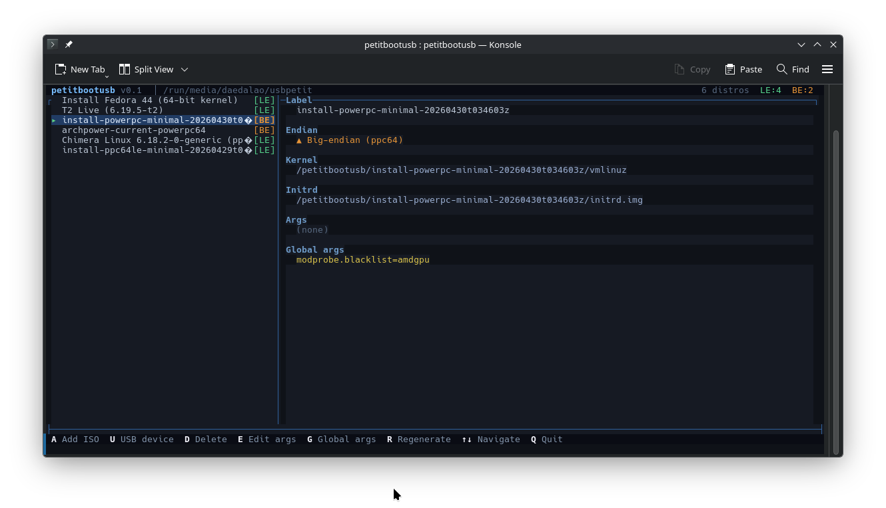

# petitbootusb

Multi-ISO USB preparation tool for IBM POWER8 / OpenPOWER systems running
[Petitboot](https://github.com/open-power/petitboot), the firmware
bootloader baked into the PNOR flash of OpenPOWER machines (S822LC and
friends).

Point it at a mounted USB and a list of ISO images and it extracts
kernels, initrds, and rootfs squashfs files into per-distro subdirectories
and writes a `grub.cfg` that Petitboot can read directly.

The USB does **not** need to be "bootable" in the MBR/UEFI sense. Petitboot
runs from firmware, scans attached storage, parses any `grub.cfg` it finds,
and uses `kexec` to load the selected kernel.



## Features

- Single static binary, no runtime D dependencies.
- Non-destructive: existing files on the USB are left alone.
- Per-distro and global kernel argument editing, with `grub.cfg`
  regenerated from stored metadata.
- Both little-endian (`ppc64le`) and big-endian (`ppc64`) kernels can
  coexist on the same drive — the ELF header of each kernel is inspected
  and tagged at `add` time.
- Interactive full-screen TUI **or** plain CLI subcommands.
- ISO inspection via `bsdtar` — no root, no loop mounts.

### Supported ISO types

| Type | Distros tested | Notes |
|------|----------------|-------|
| `FedoraDracut` | Fedora ppc64le | `rd.live.image` + `rd.live.dir=` |
| `UbuntuCasper` | Ubuntu ppc64el | `boot=casper` + `live-media-path=` |
| `DebianLive`   | Debian, **Chimera Linux** | `boot=live` + `live-media-path=`; EROFS rootfs supported |
| `ArchISO`      | Arch Power (LE/BE/32) | `archisobasedir=` + `archisolabel=` |
| `T2SDE`        | T2 SDE | initrd patched to remove hardcoded `fs=iso9660` line |
| `MinimalInstaller` | Gentoo ppc/ppc64le | rootfs embedded in initrd, args used verbatim |
| `Generic` | unrecognised | device refs stripped, no rootfs path substituted |

## Build

Native (host == target):

```sh
make           # uses dmd by default
make DMD=ldc2  # build with LDC instead
```

Cross-compile to ppc64le from x86_64 (requires LDC with the ppc64le target):

```sh
make cross     # produces ./petitbootusb-ppc64le
```

`dmd` does not target `ppc64le`; use `ldc2` on the POWER box itself or
cross-compile with `make cross`.

## Install

```sh
sudo make install   # /usr/local/bin/petitbootusb + man page
```

## USB preparation

A single ext4 partition is recommended. ext4 has no 4 GiB file size limit
(some squashfs images blow past it) and preserves Unix permissions. Format
with the conventional label and your own UID at the root, so subsequent
runs don't need root:

```sh
sudo parted /dev/sdX mklabel msdos
sudo parted /dev/sdX mkpart primary ext4 1MiB 100%
sudo mkfs.ext4 -L usbpetit -E root_owner=$(id -u):$(id -g) /dev/sdX1
sudo mount /dev/sdX1 /mnt/usb
```

## Usage

Interactive TUI (recommended):

```sh
petitbootusb /mnt/usb
```

CLI:

```sh
petitbootusb add        /mnt/usb fedora.iso gentoo.iso ...
petitbootusb list       /mnt/usb
petitbootusb edit       /mnt/usb <name>
petitbootusb global     /mnt/usb              # args appended to every entry
petitbootusb remove     /mnt/usb <name>
petitbootusb regenerate /mnt/usb              # rebuild grub.cfg from metadata
```

See `man petitbootusb` for full reference, key bindings, and per-distro
argument translation rules.

## Layout written to the USB

```
<usb>/
  petitbootusb/
    <distro-name>/
      vmlinuz
      initrd.img
      LiveOS/squashfs.img            # or casper/, live/, airootfs.sfs, live.squash
      metadata.json                  # label, args, endian, paths
    .global-args
  boot/
    grub/
      grub.cfg                       # Petitboot reads this
```

Everything else on the USB is left untouched.

## Dependencies

| Tool | When needed | Package |
|------|-------------|---------|
| `bsdtar` | always | `libarchive` |
| `zstd`, `cpio` | adding T2/SDE ISOs (initrd patch) | usually preinstalled |

## Caveats

- **Petitboot parses GRUB syntax but does not execute GRUB.**
  `loopback`, `insmod`, scripting, etc. are silently ignored. Kernels and
  initrds must be physically present on the USB; ISO loop-boot is not
  possible.
- **No PReP partition needed.** PReP is only required when installing GRUB2
  itself; petitbootusb just hands files to Petitboot.

## License

GPL-3.0-or-later. See [LICENSE](LICENSE).
